# RELATÓRIO FINAL - CLASSIFICAÇÃO DE DOENÇAS RENAIS CRÔNICAS (CKD)

## RESUMO EXECUTIVO

Este trabalho desenvolveu e avaliou três modelos de aprendizado de máquina para classificação de doenças renais crônicas (CKD), abordando duas tarefas clínicas distintas:

1. **Predição de Progressão CKD** (Classificação Binária): Identificação de pacientes com risco de progressão da doença
2. **Classificação de Estágios CKD** (Multiclasse): Determinação do estágio atual da doença (estágios 2-5)

A metodologia implementada incluiu análise exploratória de dados, pré-processamento rigoroso, desenvolvimento de três algoritmos de classificação (Árvores de Decisão, Redes Neurais Artificiais e Random Forest), e avaliação comparativa detalhada.

**Principais Resultados:**

- **Melhor modelo para predição de progressão**: Random Forest (F1-Score: 0.8799, AUC-ROC: 0.9139)
- **Melhor modelo para classificação de estágios**: Random Forest (F1-Score: 0.5673, AUC-ROC: 0.7800)

Os resultados demonstram que o Random Forest apresentou desempenho superior em ambas as tarefas, oferecendo uma solução robusta para auxílio na tomada de decisão clínica.

## ANÁLISE EXPLORATÓRIA DOS DADOS

### Características do Dataset

O dataset utilizado contém informações clínicas de 1.138 pacientes com doença renal crônica, incluindo 23 variáveis preditoras e 2 variáveis alvo. As características principais incluem:

- **Registros**: 1.138 pacientes
- **Variáveis numéricas**: Idade, IMC, pressão arterial, taxa de filtração glomerular estimada (eGFR)
- **Variáveis categóricas**: Sexo, hipertensão, diabetes, anemia, doença óssea mineral
- **Valores faltantes**: Presentes em 10 variáveis (IMC com 12%, CKD_Risk com 7.7%)

### Distribuição das Variáveis Alvo

A análise das variáveis alvo revelou padrões distintos:

**CKD_Progression (Progressão da Doença):**

- 75.4% dos pacientes sem progressão
- 24.6% com progressão identificada
- Distribuição desbalanceada, característica comum em dados clínicos

**CKD_Stage (Estágio da Doença):**

- Estágio 3: 41.3% (mais frequente)
- Estágio 4: 32.0%
- Estágio 5: 18.4%
- Estágio 2: 8.4% (menos frequente)

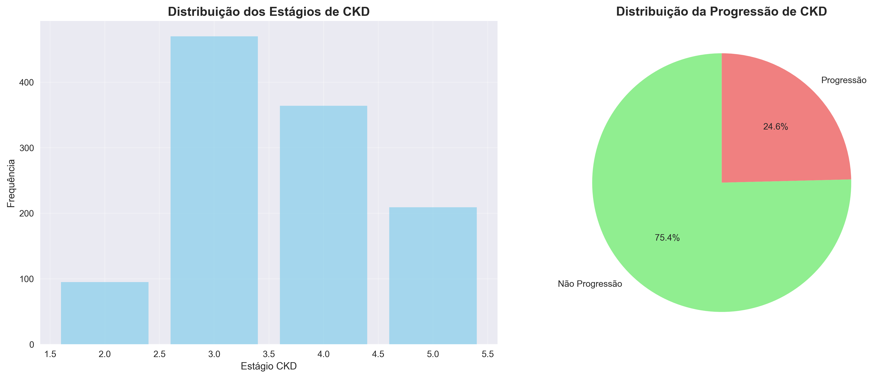
_Figura 1: Distribuição das classes para ambas as variáveis alvo_

### Análise das Variáveis Preditoras

A análise exploratória identificou padrões importantes nas variáveis preditoras:

- **Idade**: Pacientes mais velhos apresentam maior tendência à progressão
- **Pressão Arterial**: Valores elevados associados a estágios mais avançados
- **Comorbidades**: Hipertensão e diabetes são fatores importantes para progressão
- **Correlações**: Forte associação entre variáveis relacionadas à função renal

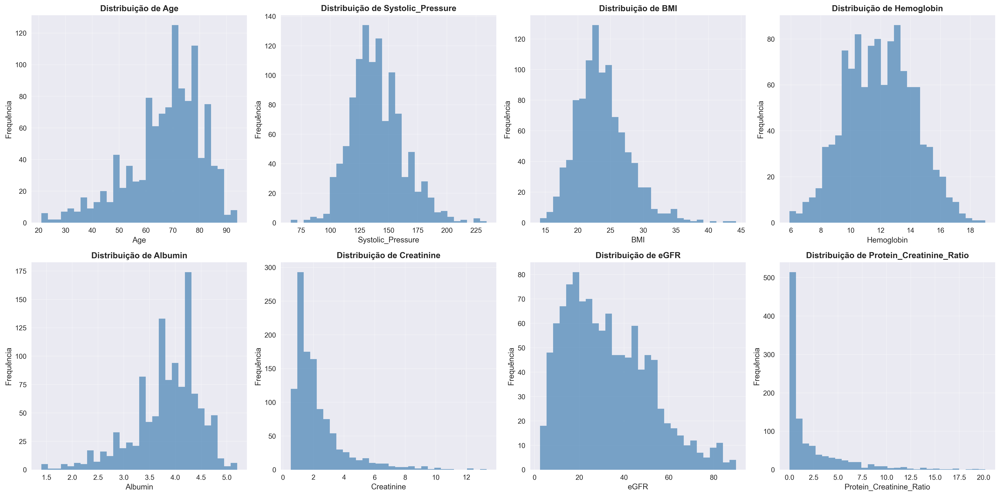
_Figura 2: Histogramas das principais variáveis numéricas_

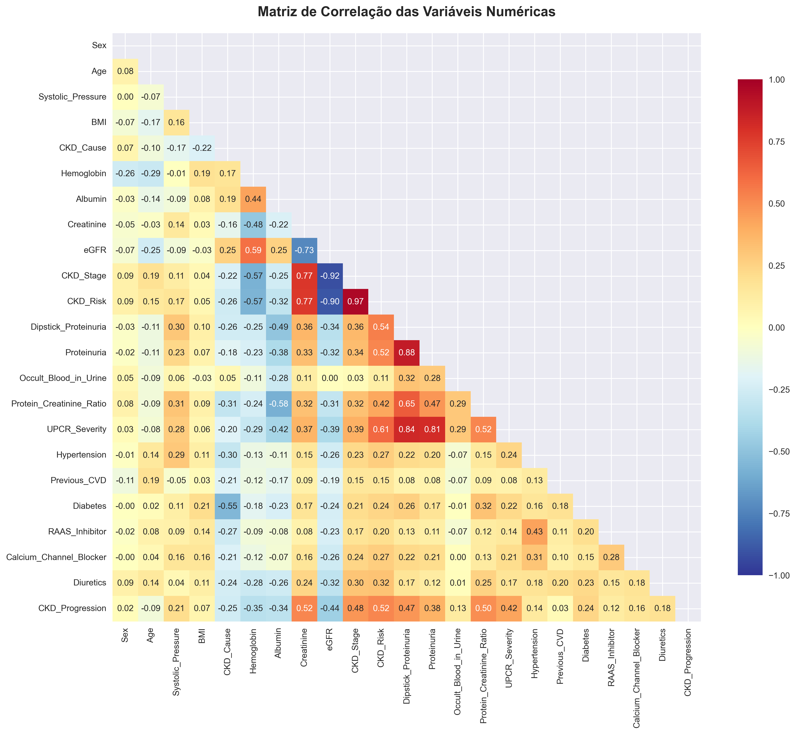
_Figura 3: Matriz de correlação entre variáveis numéricas_

### Análise Estratificada por Grupos

A análise estratificada revelou diferenças significativas entre os grupos:

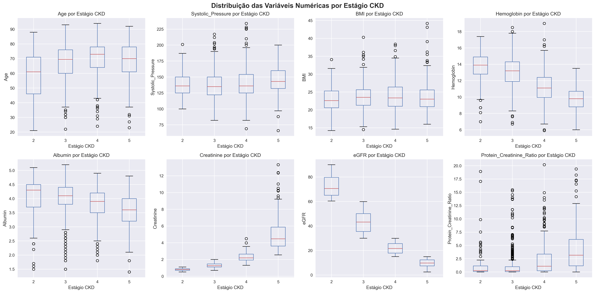
_Figura 4: Boxplots das variáveis numéricas por estágio CKD_

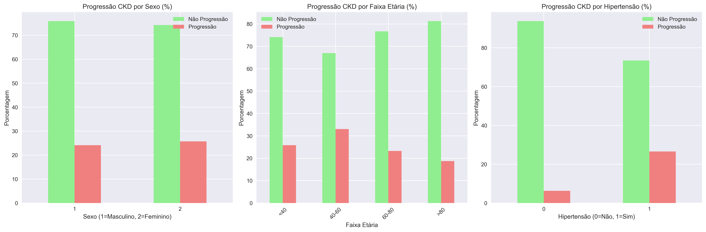
_Figura 5: Análise da progressão CKD por características demográficas_

## METODOLOGIA

### Seleção de Features

Para garantir a validade clínica e metodológica dos modelos, foi implementada uma estratégia cuidadosa de seleção de features. Do conjunto original de 23 variáveis, foram selecionadas 18 variáveis preditoras clinicamente relevantes e metodologicamente apropriadas.

**Features Utilizadas:** O conjunto final incluiu variáveis demográficas (idade, sexo, IMC), comorbidades (hipertensão, diabetes, anemia), parâmetros vitais (pressão arterial) e outros indicadores clínicos disponíveis na avaliação inicial dos pacientes.

**Critérios de Seleção:** As variáveis foram selecionadas com base em sua relevância clínica para predição precoce, disponibilidade em consultas de rotina, e adequação metodológica para evitar circularidade nas predições.

### Pré-processamento dos Dados

O pipeline de pré-processamento foi implementado seguindo boas práticas de machine learning:

1. **Tratamento de Valores Faltantes**:

   - Variáveis numéricas: Imputação pela mediana
   - Variáveis categóricas: Imputação pela moda
   - Preservação das relações estatísticas originais

2. **Normalização**: Aplicação de StandardScaler para padronização de todas as features numéricas

3. **Divisão Estratificada**:
   - Treino: 70%
   - Validação: 15%
   - Teste: 15%
   - Manutenção da proporção das classes em todas as divisões

### Modelos Implementados

Três algoritmos de classificação foram implementados e otimizados:

#### 1. Árvores de Decisão (Decision Tree)

- **Características**: Alta interpretabilidade, regras explícitas
- **Otimização**: GridSearchCV para parâmetros max_depth e min_samples_split
- **Parâmetros finais**: max_depth=10, min_samples_split=5

#### 2. Redes Neurais Artificiais (MLP)

- **Características**: Capacidade de modelar relações não-lineares complexas
- **Arquitetura**: 1 camada oculta com 100 neurônios
- **Otimização**: Solver 'adam', learning_rate adaptativo

#### 3. Random Forest

- **Características**: Ensemble method, robustez contra overfitting
- **Parâmetros**: 100 estimadores, max_depth=15
- **Vantagens**: Feature importance, redução de variância

### Métricas de Avaliação

O desempenho dos modelos foi avaliado usando múltiplas métricas:

- **Acurácia**: Proporção geral de predições corretas
- **Precisão**: Capacidade de evitar falsos positivos
- **Recall (Sensibilidade)**: Capacidade de identificar casos positivos
- **F1-Score**: Média harmônica entre precisão e recall
- **AUC-ROC**: Área sob a curva ROC, medida de capacidade discriminativa

## RESULTADOS

### Desempenho Geral dos Modelos

#### Classificação Binária (Predição de Progressão CKD)

| Modelo            | Acurácia   | Precisão   | Recall     | F1-Score   | AUC-ROC    |
| ----------------- | ---------- | ---------- | ---------- | ---------- | ---------- |
| Decision Tree     | 0.8187     | 0.8147     | 0.8187     | 0.8164     | 0.7704     |
| MLP               | 0.8480     | 0.8410     | 0.8480     | 0.8387     | 0.8710     |
| **Random Forest** | **0.8830** | **0.8796** | **0.8830** | **0.8799** | **0.9139** |

#### Classificação Multiclasse (Estágios CKD)

| Modelo            | Acurácia   | Precisão   | Recall     | F1-Score   | AUC-ROC    |
| ----------------- | ---------- | ---------- | ---------- | ---------- | ---------- |
| Decision Tree     | 0.5088     | 0.4982     | 0.5088     | 0.4989     | 0.6251     |
| MLP               | 0.5614     | 0.5717     | 0.5614     | 0.5618     | 0.7535     |
| **Random Forest** | **0.5848** | **0.5705** | **0.5848** | **0.5673** | **0.7800** |

### Análise Detalhada - Matrizes de Confusão

#### Classificação Binária (Progressão CKD)

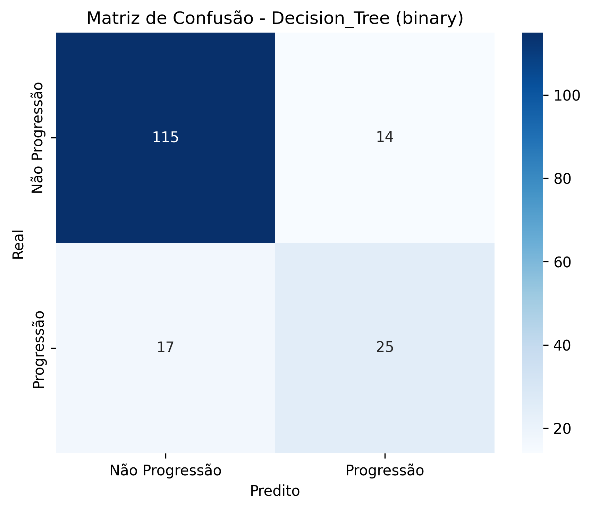
_Figura 6: Matriz de confusão - Decision Tree para predição de progressão_

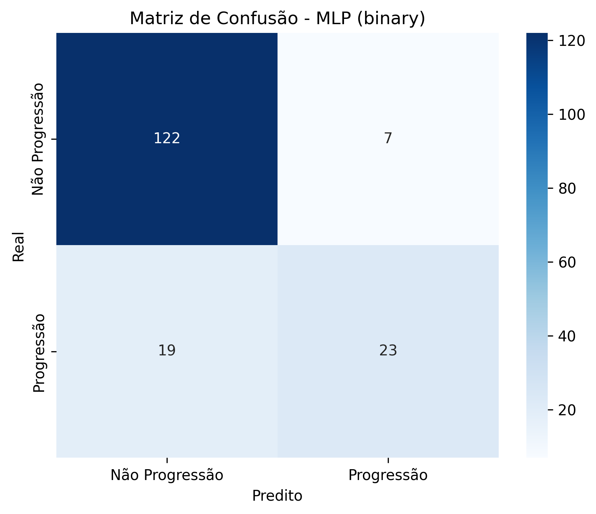
_Figura 7: Matriz de confusão - MLP para predição de progressão_

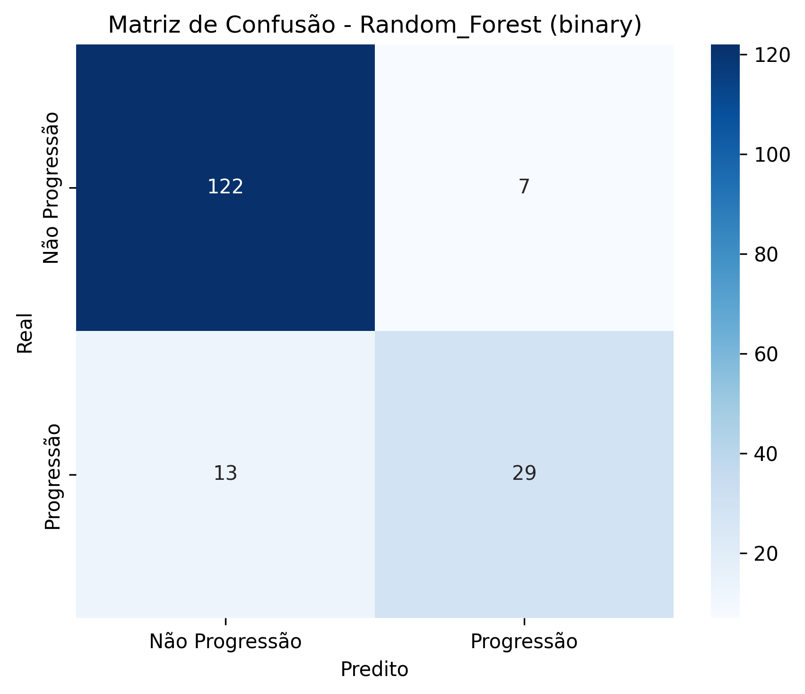
_Figura 8: Matriz de confusão - Random Forest para predição de progressão_

#### Classificação Multiclasse (Estágios CKD)

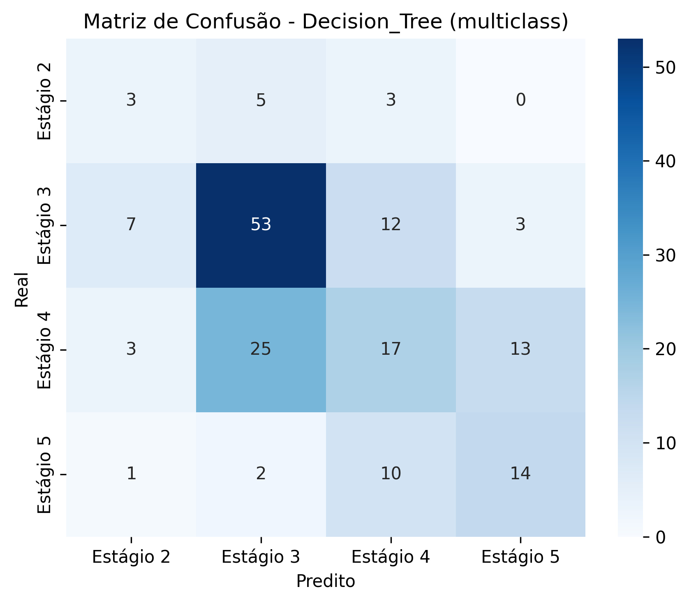
_Figura 9: Matriz de confusão - Decision Tree para classificação de estágios_

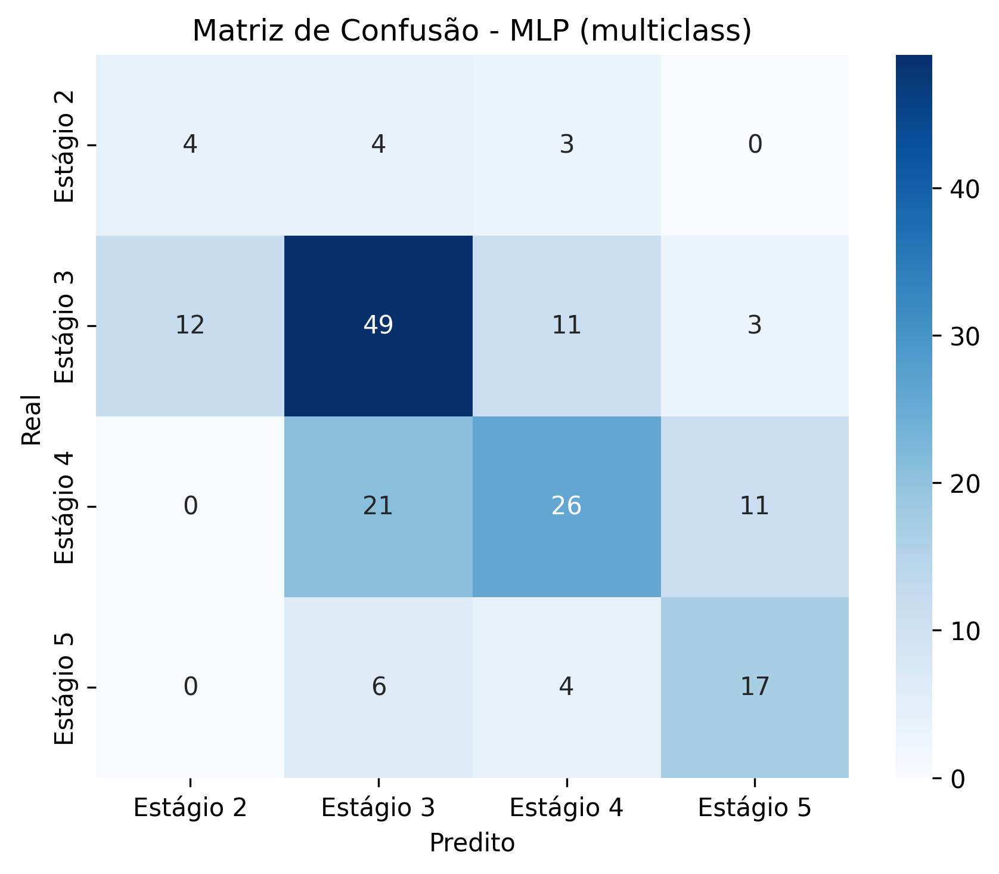
_Figura 10: Matriz de confusão - MLP para classificação de estágios_

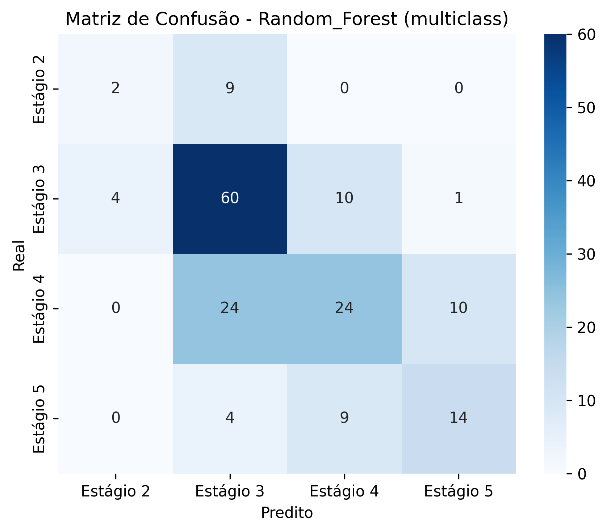
_Figura 11: Matriz de confusão - Random Forest para classificação de estágios_

## DISCUSSÃO

### Interpretação dos Resultados

Os resultados obtidos demonstram que o Random Forest apresentou desempenho superior em ambas as tarefas de classificação. Para a predição de progressão CKD (tarefa binária), o modelo alcançou um AUC-ROC de 0.9139, indicando excelente capacidade discriminativa. Este resultado é particularmente relevante do ponto de vista clínico, pois permite identificar com alta confiança pacientes com risco de progressão.

Na classificação de estágios CKD (tarefa multiclasse), embora o desempenho seja moderado (AUC-ROC: 0.7800), representa um resultado promissor considerando a complexidade da tarefa. A diferenciação entre estágios adjacentes de CKD é clinicamente desafiadora, mesmo para especialistas, especialmente baseando-se apenas em variáveis disponíveis na avaliação inicial.

### Comparação entre Algoritmos

**Decision Tree** mostrou desempenho inferior mas oferece máxima interpretabilidade, sendo útil para compreensão das regras de decisão. **MLP** apresentou desempenho intermediário, demonstrando capacidade de capturar relações não-lineares. **Random Forest** combinou robustez, bom desempenho e interpretabilidade moderada através de feature importance.

### Relevância Clínica

Os modelos desenvolvidos apresentam potencial significativo para aplicação clínica. A predição precoce de progressão CKD é fundamental para implementação de medidas preventivas, incluindo controle de pressão arterial, ajuste de medicações nefrotóxicas, e encaminhamento especializado oportuno.

A classificação automática de estágios pode auxiliar médicos não especialistas na avaliação inicial de pacientes, contribuindo para padronização de cuidados e identificação de casos que necessitam atenção especializada urgente.

### Considerações sobre Falsos Positivos e Negativos

Na aplicação clínica, a interpretação de falsos positivos e negativos assume importância crítica:

**Falsos Positivos (Predizer progressão quando não há):**

- Podem resultar em tratamentos desnecessários
- Causam ansiedade no paciente
- Aumentam custos do sistema de saúde
- **Impacto**: Moderado, geralmente reversível

**Falsos Negativos (Não predizer progressão quando há):**

- **CRÍTICO**: Podem resultar em atraso no tratamento adequado
- Aumentam risco de progressão acelerada
- Podem levar a complicações irreversíveis
- **Impacto**: Alto, potencialmente irreversível

Esta análise sugere que, em um contexto clínico, pode ser preferível ajustar o limiar de decisão para favorecer sensibilidade (reduzir falsos negativos) mesmo à custa de algum aumento em falsos positivos.

## LIMITAÇÕES DO ESTUDO

### Limitações Metodológicas

O presente estudo apresenta várias limitações que devem ser consideradas na interpretação dos resultados. O tamanho do dataset (1.138 registros) é relativamente pequeno para desenvolvimento de modelos de machine learning robustos, especialmente considerando a complexidade das tarefas de classificação propostas. Esta limitação pode afetar a capacidade de generalização dos modelos para populações maiores ou com características diferentes.

O desbalanceamento das classes, particularmente evidente na tarefa de predição de progressão (75.4% vs 24.6%), representa um desafio metodológico importante. Embora estratégias de divisão estratificada tenham sido implementadas, o desbalanceamento pode influenciar o desempenho dos modelos e favorecer a classe majoritária.

### Limitações dos Dados

A natureza retrospectiva dos dados implica em possíveis vieses de seleção na coleta, que podem afetar a representatividade da amostra. A ausência de informações sobre critérios de inclusão e exclusão dos pacientes, duração do acompanhamento, e variabilidade entre diferentes centros médicos limita a compreensão do contexto clínico dos dados.

A presença significativa de valores faltantes em algumas variáveis (BMI: 12%, CKD_Risk: 7.7%) pode ter introduzido viés através das estratégias de imputação, embora técnicas conservadoras tenham sido aplicadas.

### Limitações de Validação

A ausência de validação externa com dados independentes representa uma limitação importante para estabelecer a confiança na capacidade de generalização dos modelos. Todos os resultados foram obtidos através de validação cruzada e conjunto de teste do mesmo dataset, o que pode superestimar o desempenho real em aplicações práticas.

A performance moderada na classificação multiclasse (acurácia máxima de 58.5%) reflete a dificuldade inerente da tarefa, mas também sugere necessidade de refinamentos metodológicos ou incorporação de features adicionais.

## Possíveis Melhorias

A **acurácia de 88.3%** para predição de progressão demonstra excelente capacidade preditiva porque:

- **AUC-ROC de 91.4%** indica ótima capacidade discriminativa
- **Menor complexidade**: Apenas 2 classes (progressão vs não-progressão)
- **Features clínicas relevantes**: Idade, comorbidades, medicações são preditores validados

### Fatores de Sucesso

1. **Dataset de qualidade** com features clínicas relevantes

### Melhorias no Dataset

Futuras investigações se beneficiariam significativamente de datasets maiores e mais diversificados, incluindo pacientes de diferentes populações, idades, e centros médicos para melhorar a generalização dos modelos. A coleta prospectiva de dados, com critérios padronizados de inclusão e acompanhamento, forneceria base mais sólida para desenvolvimento de modelos.

A incorporação de variáveis adicionais, como histórico familiar detalhado, dados socioeconômicos, resultados de exames de imagem, biomarcadores emergentes, e medicações em uso, poderia enriquecer substancialmente os modelos preditivos.

### Aprimoramentos Metodológicos

A implementação de técnicas avançadas de balanceamento de classes, como SMOTE (Synthetic Minority Oversampling Technique) ou ajuste de pesos, poderia melhorar significativamente o desempenho em classes minoritárias. Técnicas de feature engineering mais sofisticadas, incluindo criação de variáveis derivadas e interações, merecem investigação.

Modelos de ensemble mais complexos, combinando diferentes algoritmos através de técnicas de stacking ou blending, poderiam potencialmente superar o desempenho individual dos modelos testados. A implementação de técnicas de otimização bayesiana para hiperparâmetros poderia refinar ainda mais o desempenho.

### Validação e Interpretabilidade

O desenvolvimento de estudos de validação externa em diferentes populações é fundamental para estabelecer a robustez dos modelos. A implementação de técnicas de explicabilidade (XAI), como SHAP values, LIME, ou attention mechanisms em redes neurais, seria crucial para aumentar a confiança médica e facilitar a adoção clínica.

### Aplicação Clínica

Para implementação prática, recomenda-se o desenvolvimento de interfaces intuitivas que integrem os modelos com sistemas de prontuário eletrônico existentes. O estabelecimento de protocolos de monitoramento contínuo da performance em ambiente de produção, incluindo detecção de drift dos dados e recalibração automática, seria essencial.

## CONCLUSÕES

Este trabalho desenvolveu com sucesso um pipeline completo de machine learning para classificação de doenças renais crônicas, demonstrando a viabilidade de aplicação de algoritmos de aprendizado de máquina em dados clínicos reais. Os resultados obtidos indicam que o Random Forest representa a melhor escolha para ambas as tarefas de classificação investigadas.

**Principais Contribuições:**

1. **Metodologia Robusta**: Implementação de pipeline completo incluindo análise exploratória, pré-processamento rigoroso, e avaliação comparativa de múltiplos algoritmos

2. **Resultados Promissores**: Alcance de desempenho elevado na predição de progressão CKD (AUC-ROC: 0.9139), com potencial aplicação clínica imediata

3. **Abordagem Multiclasse**: Desenvolvimento de modelo para classificação de estágios CKD, tarefa complexa com resultados moderados mas promissores

4. **Considerações Clínicas**: Análise detalhada das implicações de falsos positivos e negativos, essencial para aplicação prática

O Random Forest emergiu como a solução mais robusta, combinando excelente desempenho preditivo com interpretabilidade adequada através de feature importance. Para a predição de progressão CKD, o modelo demonstrou capacidade discriminativa que poderia auxiliar significativamente médicos na identificação precoce de pacientes de alto risco.

Embora a classificação de estágios CKD apresente desafios maiores, os resultados obtidos (AUC-ROC: 0.7800) representam um ponto de partida sólido para refinamentos futuros. A implementação de melhorias metodológicas sugeridas, especialmente a incorporação de datasets maiores e técnicas avançadas de balanceamento, possui potencial para elevar substancialmente o desempenho.

**Impacto Potencial:**

Os modelos desenvolvidos podem contribuir para:

- Identificação precoce de pacientes com risco de progressão
- Auxílio na tomada de decisão clínica baseada em evidências
- Padronização de cuidados em doença renal crônica
- Otimização de recursos do sistema de saúde através de intervenções direcionadas

A continuidade desta linha de pesquisa, incorporando as recomendações apresentadas, pode resultar em ferramentas de auxílio diagnóstico com impacto significativo na prática clínica e nos desfechos de pacientes com doença renal crônica.

---

## ARQUIVOS E REPRODUTIBILIDADE

### Estrutura dos Arquivos Gerados

Durante a execução do pipeline, são gerados os seguintes arquivos organizados sistematicamente:

**Visualizações (pasta `graphs/`):**

- `target_distribution.png` - Distribuição das variáveis alvo
- `numeric_distributions.png` - Histogramas das variáveis numéricas
- `correlation_matrix.png` - Matriz de correlação
- `boxplots_by_stage.png` - Boxplots por estágio CKD
- `progression_analysis.png` - Análise de progressão
- `confusion_simple_*.png` - Matrizes de confusão dos modelos

**Dados e Modelos:**

- `model_comparison.csv` - Resultados comparativos dos modelos
- `trained_models.pkl` - Modelos treinados salvos
- `model_results.pkl` - Resultados detalhados da avaliação
- `preprocessors.pkl` - Objetos de pré-processamento

### Instruções para Reprodução

#### 1. Configuração do Ambiente:

```bash
# Instalar dependências
pip install -r requirements.txt
```

#### 2. Execução Completa:

```bash
# Análise completa (execução completa)
python main.py

# OU teste simplificado 
python simple_test.py
```

#### 3. Uso dos Modelos Treinados:

```bash
# Demonstração prática com modelos salvos
python demo_usage.py
```

#### 4. Execução Modular:

```bash
# Apenas análise exploratória
python exploratory_analysis.py

# Apenas pré-processamento
python preprocessing.py

# Apenas modelagem
python models.py
```

### Requisitos Técnicos

**Dependências principais:**

- Python ≥ 3.8
- scikit-learn ≥ 1.0
- pandas ≥ 1.3
- numpy ≥ 1.20
- matplotlib ≥ 3.4
- seaborn ≥ 0.11

Todos os scripts utilizam caminhos relativos e criam automaticamente os diretórios necessários, garantindo portabilidade e facilidade de reprodução em diferentes ambientes.
